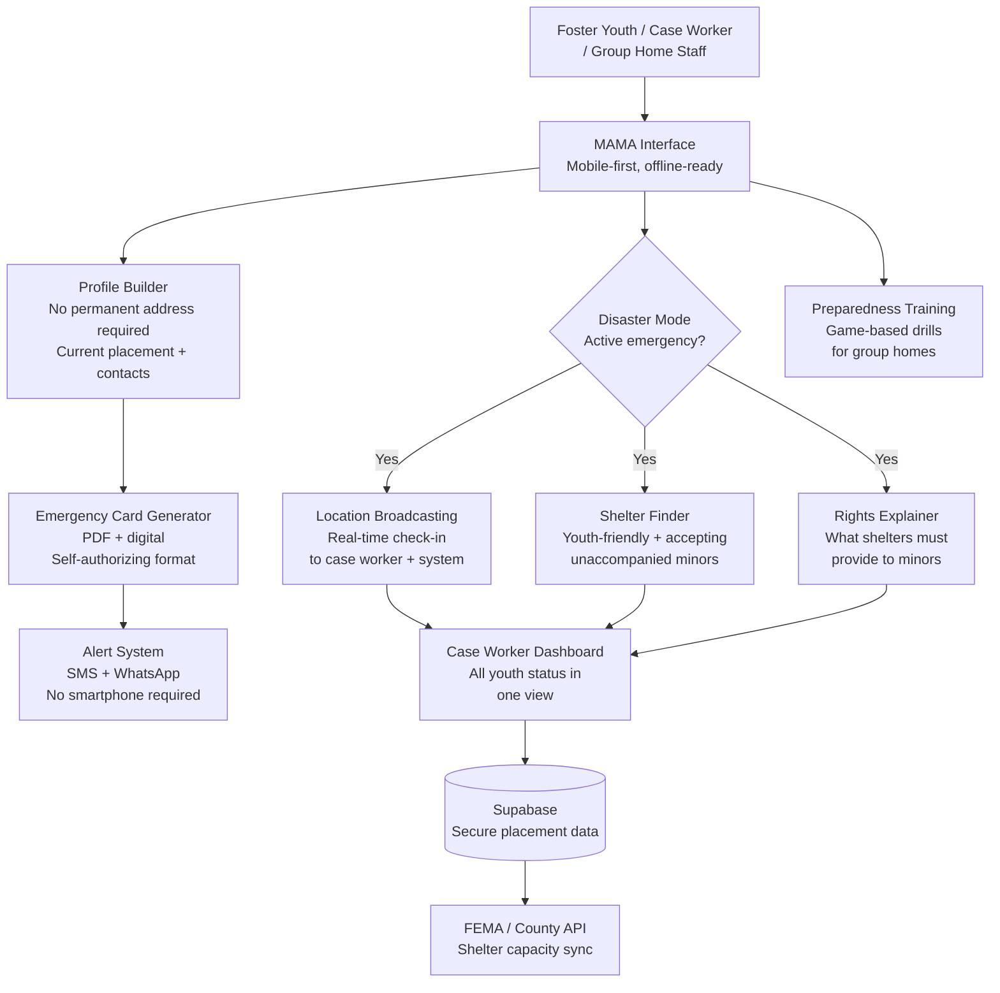

<p align="center">
  <h1 align="center">foundation-ready-youth</h1>
  <h3 align="center"><em>Disaster preparedness for foster youth. Zero emergency contacts.</em></h3>
</p>

<p align="center">
  <a href="LICENSE"></a>
  
  
  <a href="https://mama.oliwoods.ai"></a>
  <a href="https://mama.oliwoods.ai/foundation"></a>
</p>

---

> *"When the earthquake hit, every emergency shelter asked for a parent or guardian to sign the intake form. She was 17. She had no one to call. She slept outside."*
> — National Foster Youth Institute, 2022 Disaster Report

## Why This Exists

Disaster preparedness systems are built around the assumption of a stable household — a permanent address, emergency contacts, a parent who can sign forms. Foster youth have none of these by definition. In a disaster, they become invisible.

- **400,000+ youth** are in the U.S. foster care system at any given time (Annie E. Casey Foundation, 2023)
- **23,000 youth age out** of foster care every year with no permanent family safety net (NFYI)
- **0 emergency contacts** is the norm for youth in group homes, transitional living programs, and those who have aged out
- **Foster youth are 3x more likely** to experience housing instability during and after disasters due to placement disruption (Urban Institute, 2022)

Every standard emergency plan assumes someone will come for you. This one doesn't make that assumption.

## System Architecture



## Features

| Feature | Description | Standard |
|---------|-------------|----------|
| **Youth Emergency Profile** | Placement-aware profile that doesn't require permanent address or parental consent | Minors-first design |
| **Self-Authorizing Emergency Card** | Printable + digital ID card usable without guardian signature at shelters | FEMA shelter intake compatible |
| **Case Worker Command Center** | Real-time status of all youth in caseload during active disasters | SACWIS-aligned |
| **Rights-in-Disasters Explainer** | Plain-language guide to what shelters, hospitals, and agencies must provide to unaccompanied minors | Legal aid partnerships |
| **SMS-First Alerts** | Works on any phone, including prepaid; no app required | Twilio SMS |
| **Shelter Compatibility Check** | Filters shelter database for youth-accepting, unaccompanied-minor-friendly locations | FEMA + county data |
| **Group Home Drill Mode** | Game-based emergency drills designed for group living settings | FEMA Ready.gov curriculum |
| **Aging-Out Transition Plan** | Pre-built emergency plan for youth approaching 18 with no permanent placement | NFYI transition framework |

## Research Foundation

| Citation | Finding | Relevance |
|----------|---------|-----------|
| Urban Institute (2022) | Foster youth 3x more likely to lose placement during disaster; system has no protocol | Core mission driver |
| Annie E. Casey Foundation (2023) | 400K+ youth in care; group home placements most vulnerable to displacement | Target population |
| FEMA (2021) | Less than 5% of disaster plans address unaccompanied minors specifically | Gap in existing systems |
| NFYI (2022) | Aged-out youth with no family support have no role in any federal disaster framework | Aging-out module |

## Quick Start

```bash
git clone https://github.com/OliWoods-Org/foundation-ready-youth.git
cd foundation-ready-youth
npm install
npm run dev
```

## Tech Stack

- **Runtime:** Node.js + TypeScript
- **Validation:** Zod schemas
- **Database:** Supabase (PostgreSQL)
- **AI:** Claude API / local LLM (offline mode)
- **Alerts:** Twilio (SMS/WhatsApp — works on any phone), Resend (email)
- **Data:** FEMA shelter API, county emergency management feeds

## Contributing

We seek contributions from foster care alumni, social workers, DCFS/CPS professionals, emergency management specialists, and legal aid attorneys who work with minors. If you aged out of foster care, your perspective is the most valuable one here.

1. Fork the repo
2. Create a feature branch (`git checkout -b feat/amazing-feature`)
3. Commit your changes
4. Push and open a PR

## License

AGPL-3.0 — Free to use, modify, and distribute.

---

<p align="center">
  <strong>Built by the <a href="https://oliwoods.ai">OliWoods Foundation</a></strong><br>
  <em>Free forever. Open source. Because no child should be invisible in an emergency.</em>
</p>
